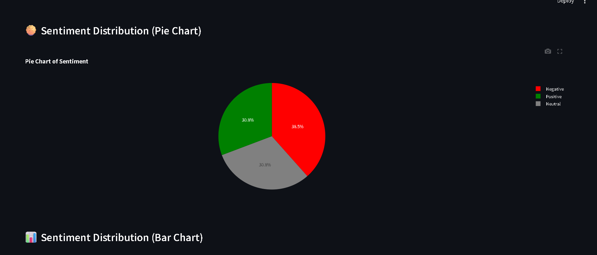
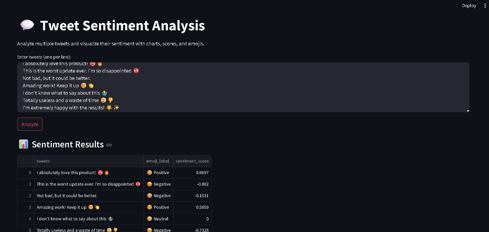
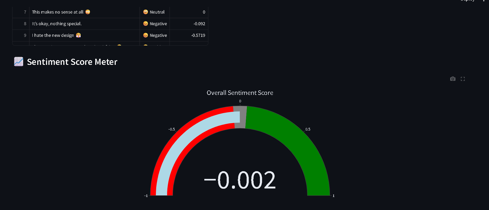

# 🎯 Tweet Sentiment Analysis App

A Streamlit application that uses Python and NLTK's VADER lexicon to perform sentiment analysis on raw text tweets.

## 📸 Screenshots

### Main Interface and Results
This demonstrates the text input, the data table of analyzed tweets showing the VADER compound score, and appropriate emoji mapping.


### Sentiment Visualizations
The app provides a gauge chart showing the average sentiment score across all tweets, and pie/bar charts showing the distribution of positive, negative, and neutral sentiments.




## 🛠️ Built With

* [Streamlit](https://streamlit.io/) - The web framework used.
* [NLTK VADER](https://www.nltk.org/api/nltk.sentiment.vader.html) - Used for sentiment scoring.
* [Plotly Express](https://plotly.com/python/plotly-express/) - Used for interactive charts.
* Pandas - For data manipulation.

## ⚙️ How to Run Locally

1.  Clone this repository.
2.  Install dependencies:
    ```bash
    pip install -r requirements.txt
    ```
3.  Run the app:
    ```bash
    streamlit run sentiment_analysis.py
    ```
